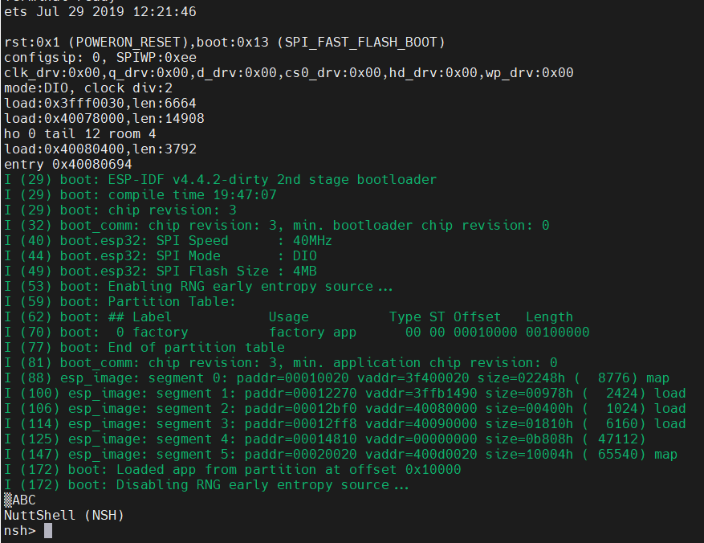

# NuttX protected mode

This tutorial provides the necessary steps for booting NuttX in [protected mode](https://nuttx.apache.org/docs/latest/platforms/xtensa/esp32/boards/esp32-devkitc/index.html#knsh).

## Knsh

Instead of nsh, knsh is the default configuration for running in protected mode: `./tools/configure.sh -l esp32-devkitc:knsh`.

## Custom bootloader

The knsh configuration defines the CONFIG_ESP32_BOOTLOADER_BUILD_FROM_SOURCE config, which requires that the bootloader be built manually instead of using the prebuilt binary. This happens because the build system must apply some patches on top of the bootloader sources when compiling NuttX in protected mode.

There are no changes to the partition table, the default binary can still be used.

You must use the `make bootloader` command. Possible issues that might arise:

- `cmake: command not found` -> `apt-get install cmake`
- `usr/bin/python: No module named idf_component_manager` -> `pip install idf_component_manager`
	- On my setup, "python" was a symbolic link for python2.7, while pip installed the package for the latest python version, python3.8.
	- `vim arch/xtensa/src/esp32/bootloader/esp-nuttx-bootloader/esp-idf/tools/cmake/build.cmake`
	- Search for "python" and change it into "python3.8".
- `No module named 'kconfiglib'` -> `pip install kconfiglib`
- Toolchain error: `/opt/xtensa/xtensa-esp32-elf-2020r2/bin/xtensa-esp32-elf-gcc, crosstool-ng version esp-2020r2 doesn't match supported version esp-2021r2-patch3`
	- Download it: `wget https://github.com/espressif/crosstool-NG/releases/download/esp-2021r2-patch3/xtensa-esp32-elf-gcc8_4_0-esp-2021r2-patch3-linux-amd64.tar.gz`
	- Alternatively, you can choose a toolchain version on your own and use `export IDF_MAINTAINER=y` to bypass the version check. Might not work - depending on the toolchain version, the code might not compile.
	- Even with the right toolchain (2021r2-patch3), we will end up getting errors when compiling the partition table. Ignore them - as specified above, for running in protected mode we only need to compile the bootloader.

## Compile and run

`make -j4` will generate nuttx.bin (kernel image) and nuttx_user.bin (user image).

When flashing the board, it is recommended to do a complete erase of the flash to make sure there are no dangling previous images: `esptool.py erase_flash`.

You can proceed afterwards with `esptool.py --chip esp32 --port /dev/ttyUSB0 --baud 921600 write_flash 0x1000 arch/xtensa/src/esp32/bootloader/esp-nuttx-bootloader/out/bootloader-esp32.bin 0x8000 ../esp-bins/partition-table-esp32.bin 0x10000 nuttx.bin 0x90000 nuttx_user.bin`. The default address for the user image is 0x90000 but it can be changed through the ESP32_USER_IMAGE_OFFSET config.

The boot log should be similar to the one in the flat build mode:

  

