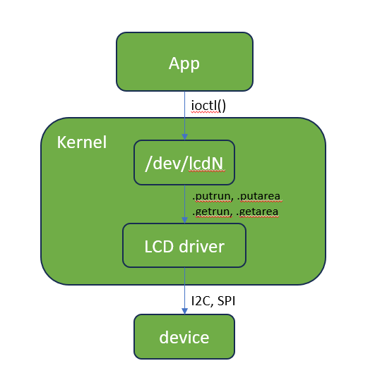
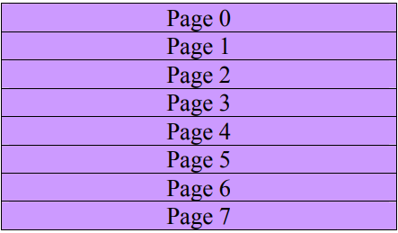
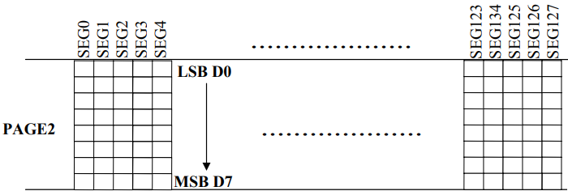
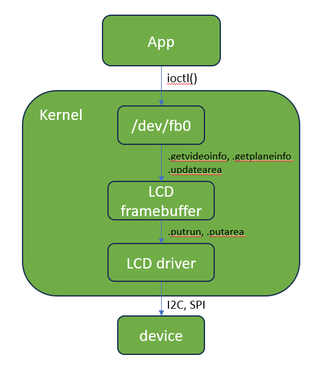

# LCD drivers

## LCD char device

The LCD driver exposes an interface in `/dev/lcdN` - where N is the number of the display - through which the user can configure a low-level display by making use of `ioctl()` calls. However, the hardware cannot be accessed directly by the application because all the communication is done through a higher-level driver - the char device itself, found in `drivers/lcd/lcd_dev.c` - which intermediates the communication between application, the device-specific driver and afterwards the device itself. 

<p align="center">
  
</p>

In this way, NuttX provides a mechanism for decoupling the application from the hardware - the interface for interacting with the hardware is uniform, specific for all LCD drivers.

In the case of the SSD1306 controller, the GDDRAM memory layout is organized into a matrix of pixels made up of 8 rows (pages) and 128 columns. Since this is a black and white display, we only need 1 bit for representing a pix (1 BPP).

<p align="center">
  
</p>

Each page contains 8 lines, leading to a maximum resolution of 128x64.

<p align="center">
  
</p>

This memory layout allows a granularity of 1 for columns - that is, you can write any column - but you need to write a whole page even though you want to draw only a single line, for example. Because of this restriction, there are 2 possible ways to implement a display driver:

- Every time the display is written to, either the user or the driver has to read its contents and be careful not to overwrite unwanted pixels.
- The driver allocates an internal buffer of size 128x8 bytes (1 byte for each column within a page) for storing the entire display, bypassing the repeated readings for every write.

In the case of SSD1306, we cannot read the display's contents in SPI mode. Thus, the character driver implements the second method.

## Sample program

This sample program interacts directly with the LCD char device and draws a raster line across the whole display, erasing half of it afterwards.

```
#include <nuttx/config.h>
#include <nuttx/lcd/lcd_dev.h>

#include <stdio.h>
#include <stdlib.h>
#include <fcntl.h>
#include <sys/ioctl.h>

int print_to_lcd(int fd, uint8_t *data, int npixels)
{
  struct lcddev_run_s run;
  int ret;

  run.row = 10;
  run.col = 0;
  run.data = data;
  run.npixels = npixels;

  ret = ioctl(fd, LCDDEVIO_PUTRUN, &run);
  if (ret < 0)
    {
      perror("Ioctl (LCDDEVIO_PUTRUN) failed\n");
      return ret;
    }

  return 0;
}

int main(int argc, FAR char *argv[])
{
  uint8_t *data;
  int fd;

  fd = open("/dev/lcd0", 0);
  if (fd < 0)
    {
      perror("Could not open file");
      return fd;
    }

  /* Our display has a resolution of 128x32 and uses 1 bit to display a pixel
   *  so we will need only 16 bytes for representing a raster line
   */
  data = malloc(16);
  if (!data)
    {
      perror("Could not allocate memory\n");
      return -ENOMEM;
    }

  printf("Writing to LCD\n");
  memset(data, 0xff, 16);
  print_to_lcd(fd, data, 128);
  sleep(5);

  printf("Clearing LCD\n");
  memset(data, 0x0, 8);
  print_to_lcd(fd, data, 128);

  free(data);
  close(fd);

  return 0;
}
```

# Framebuffer

A framebuffer is a region of memory used for storing the entire display instead of using a byte-by-byte writing mechanism provided by the LCD character driver. A framebuffer has support either in software - provided by the framebuffer device driver - or in hardware - provided by the device itself.

In NuttX, the framebuffer is represented as a character driver - `/dev/fbN` - found in `drivers/video/fb.c`. Afterwards, control is passed to the LCD framebuffer front-end  - `drivers/lcd/lcd_framebuffer.c` - which allocates the framebuffer and passes the commands onwards to the LCD driver itself using the same API as in the case of the LCD char device. Finally, data reaches the device through I2C or SPI.

<p align="center">
  
</p>

A sample program which illustrates the way the framebuffer interface works can be found in `apps/examples/fb/`.

# NuttX graphics subsystem
