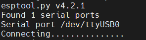
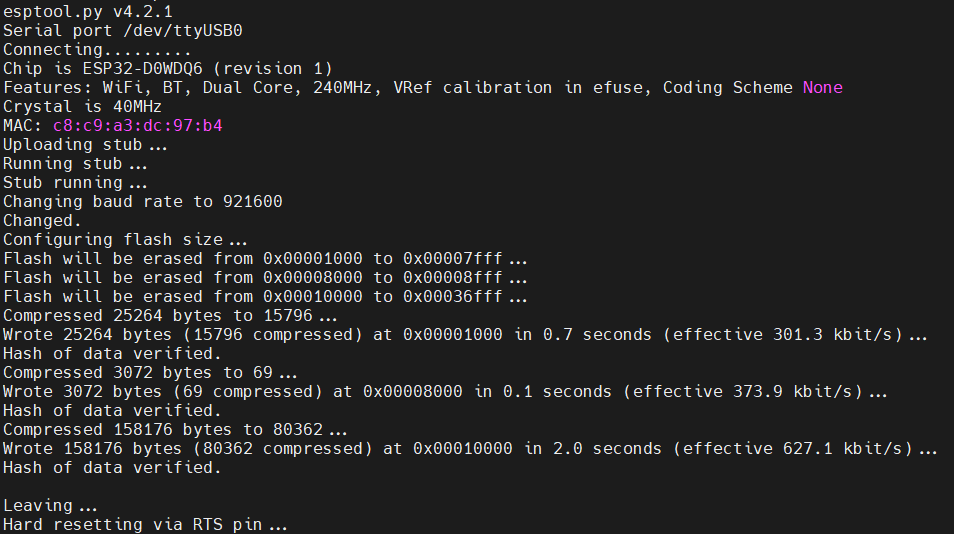
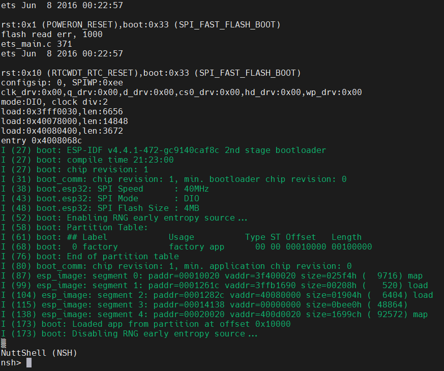

# Linux set-up tutorial

In this tutorial you will learn how to build and upload the NuttX OS on your ESP32 Sparrow boards. The Sparrow board is custom-made, built on the ESP32 Wrover module by adding:

- LTR308 light sensor
- BME680 temperature, humidity and pressure sensor
- SSD1306 128x32 OLED display
- I2S microphone
- microSD card reader

<p align="center">
  
</p>

## Environment

### Native Linux machine

You can go ahead to section [Run as sudo](#run-as-sudo).

### Windows setup

If running on Windows, you must configure a Linux virtual machine through which to access the USB ports of the host. For this you can use the [SO virtual machine](https://repository.grid.pub.ro/cs/so/linux-2021/so-ubuntu-20-04.ova) - a light Ubuntu 20.04 image that comes only with a CLI - or download the latest official image of any other Linux distributions.

If available to you, you can use the [VMware Workstation 16 pro](https://vmware.pub.ro/) which is the easiest to configure - just don't forget to add the USB controller to the VM.

If you do not have access to VMWare, please download VirtualBox. In order to ssh to your virtual machine, please do the following steps:

- add a second network adapter to the VM. The first must be a host-only device in order to provide connectivity from host to guest, while the second will be under NAT and will provide Internet acces.
- boot the virtual machine. Test with `ping 8.8.8.8` that you have Internet connectivity
- add a static IP address on the second interface in the `192.168.56.0/56` subnetwork. For mine I used `192.168.56.56/24`.

To connect the USB device to the VM instead of the host, head to the upper bar and select `Devices` > `USB Devices` > `the UART controller`.

Currently, the WSL subsystem does not provide native support for USB devices and you must use an open-source tool. Please refer to [this](https://learn.microsoft.com/en-us/windows/wsl/connect-usb) for further details.

## Run as sudo

Running as non-root will require a few extra commands for configuration.

Refer to [this](https://blog.espressif.com/getting-started-with-esp32-and-nuttx-fd3e1a3d182c) if you decide to continue as non-root.

Follow the steps below in order to get your Linux machine properly configured:

- install the package dependencies
- download the toolchain, since we won't be able to compile with the standard gcc compiler
- clone the repositories: nuttx, nuttx-apps
- download the prebuilt partition table and bootloader. Alternatively, you can compile your own binaries but this tutorial does not cover it.
- compile the NuttX binary
- finally, flash the board

## Install dependencies

```
apt-get update
apt-get upgrade -y
apt-get install -y bison flex gettext texinfo libncurses5-dev libncursesw5-dev gperf automake libtool pkg-config build-essential gperf genromfs libgmp-dev libmpc-dev libmpfr-dev libisl-dev binutils-dev libelf-dev libexpat-dev gcc-multilib g++-multilib picocom u-boot-tools util-linux chrony libusb-dev libusb-1.0.0-dev kconfig-frontends python3-pip
```

## Download the toolchain

```
curl https://dl.espressif.com/dl/xtensa-esp32-elf-gcc8_2_0-esp-2020r2-linux-amd64.tar.gz | tar -xz
mkdir /opt/xtensa
mv xtensa-esp32-elf/ /opt/xtensa/
echo "export PATH=\$PATH:/opt/xtensa/xtensa-esp32-elf/bin" >> ~/.bashrc
source ~/.bashrc
```

## Clone the repositories

```
mkdir ~/nuttxspace && cd ~/nuttxspace
git clone https://github.com/apache/incubator-nuttx.git nuttx
git clone https://github.com/apache/incubator-nuttx-apps.git apps
```

**Note**: NuttX uses a separate repository for maintaining applications. The build system will create libapps.a and will statically link it to the final NuttX binary.

## Download the prebuilt bootloader and partition table

```
mkdir esp-bins
curl -L "https://github.com/espressif/esp-nuttx-bootloader/releases/download/latest/bootloader-esp32.bin" -o esp-bins/bootloader-esp32.bin
curl -L "https://github.com/espressif/esp-nuttx-bootloader/releases/download/latest/partition-table-esp32.bin" -o esp-bins/partition-table-esp32.bin
```

## Compile and run

Please be aware that, depending on the board version, you might be required to press down the `BOOT` button when flashing the memory - this puts the board in a download state instead of the default boot state. The button must be pressed down only when the connection is being established, as depicted below:

<p align="center">
  
</p>


```
pip3 install esptool
pip3 install pyserial
cd ~/nuttxspace/nuttx
./tools/configure.sh esp32-sparrow-kit:nsh
make -j4
esptool.py erase_flash
make flash ESPTOOL_PORT=/dev/ttyUSB0 ESPTOOL_BAUD=115200 ESPTOOL_BINDIR=../esp-bins
picocom /dev/ttyUSB0 -b 115200
```

Please not that if you are compiling for another target hardware, such as the popular WROOM module, you need to use `./tools/configure.sh esp32-devkitc:nsh`. Alternatively, since Sparrow boards are built upon the WROVER module, you can also use `./tools/configure.sh esp32-wrover-kit:nsh`. However, in this case you would have to manually enable the support for various peripherals using NuttX's `make menuconfig`.

Flashing the board could be also done by using `esptool.py --chip esp32 --port /dev/ttyUSB0 --baud 921600 write_flash 0x1000 ../esp-bins/bootloader-esp32.bin 0x8000 ../esp-bins/partition-table-esp32.bin 0x10000 nuttx.bin`.

If the parameters are correct, you should see a log similar to the one below:

<p align="center">
  
</p>

Finally, the boot log should look like this:

<p align="center">
  
</p>

## Assignment

Use NuttX's build system and enable the compilation of "Hello, World!" example. Once it is uploaded on the board, run it from the command line.
